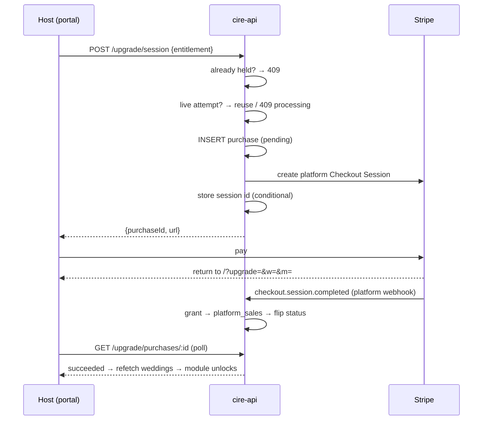

# Self-serve upgrades — buying a locked module

A cire host presses **Upgrade** on a faded nav row, pays on a Stripe-hosted page, and the module unlocks. Before this existed the only way to get `vendors` or `registry` was an operator running `grant-entitlement.ts` and pasting SQL into `wrangler d1 execute`.

Two keys are sold: **`vendors`** and **`registry`**. The other entitlement keys stay comp-only — `premium_templates` and `ai` have no finished module, and the `capacity_*` keys are derived rather than a module unlock (see `deriveCap` in [[cire-entitlements]]).

---

## The one rule everything else follows

**Only a signature-verified webhook grants an entitlement.** The browser's return from Stripe polls; it never asserts. A hand-typed `?upgrade=…` therefore buys nobody anything.

---

## Two Stripe relationships, deliberately kept apart

This is the fact that shapes the whole design.

|                    | Gifts                              | Upgrades                            |
| ------------------ | ---------------------------------- | ----------------------------------- |
| Merchant of record | The couple                         | **cire**                            |
| Charge type        | Direct, on their connected account | Platform                            |
| Endpoint           | `POST /api/stripe/webhook`         | `POST /api/stripe/platform-webhook` |
| Signing secret     | `STRIPE_WEBHOOK_SECRET`            | `STRIPE_PLATFORM_WEBHOOK_SECRET`    |
| `event.account`    | Always present                     | Must be **absent**                  |

> [!important]
> A Stripe endpoint is scoped either to the platform or to connected accounts, and each carries its own signing secret while a verifier holds exactly one. So an upgrade branch inside the Connect route would be a branch **no event could reach** — unreachable in production and green in every test, because a test signs with whatever secret it is handed. That is why there are two endpoints rather than one route with a branch.

The separate secret is the security boundary; the absent-`account` check is belt and braces behind it, so a connected account naming itself still grants nothing.

**Both endpoints are exempt from the CSRF origin guard** by exact path (`cire/api/src/lib/origin-guard.ts`). Stripe sends no `Origin`, so without the exemption the guard 403s every delivery before its signature is checked and Stripe retries the 403 for days.

---

## Flow



---

## Routes

All under `/api/organiser/weddings/:weddingId/upgrade`, in `cire/api/src/routes/upgrade.ts`.

| Route                | Gate      | Notes                                                                            |
| -------------------- | --------- | -------------------------------------------------------------------------------- |
| `GET /catalogue`     | member    | What is for sale, priced, and which keys the wedding holds                       |
| `POST /session`      | **owner** | 404 not purchasable · 409 `already_held` · 409 `processing` · 502 Stripe refused |
| `GET /purchases/:id` | member    | Wedding-scoped, so another wedding's id is not found                             |

Owner-only on the write, matching the Connect onboarding route: it names a card.

> [!warning]
> These routes carry **no** `weddingEntitlement` gate, and their role gates are mounted with **no** entitlement key. Gating the route that sells an entitlement on that entitlement is a 402 loop, and a key passed to the role gate would fold an entitlement lookup into a query whose answer can never change the response. See [[cire-entitlements]].

They are mounted **after** the `AnyElysia` widening in `app.ts`: the organiser chain is already at TypeScript's instantiation-depth limit (TS2589) and one more `.use()` there fails the type-check.

---

## Pricing

No money amount is stored in this repository. A catalogue entry names a **Stripe Price id** supplied per deployment, and the amount is read back from Stripe.

| Var                             | Key        |
| ------------------------------- | ---------- |
| `STRIPE_UPGRADE_PRICE_VENDORS`  | `vendors`  |
| `STRIPE_UPGRADE_PRICE_REGISTRY` | `registry` |

Ordinary `[vars]` in `cire/api/wrangler.toml`, not secrets — and named envs inherit no vars, so each tier declares its own. Test-mode Price ids in dev, live ones in production; a test id in production fails at checkout.

**Key-optional and fail-closed.** A key with no configured Price is not purchasable: absent from the catalogue, 404 from the checkout route. Absent configuration never means free, and a blank or whitespace var counts as absent. With no `STRIPE_SECRET_KEY` at all the routes are not mounted.

Prices are cached per isolate for ten minutes (`PRICE_CACHE_TTL_MS`) — the catalogue is read on every visit to a locked module, and each would otherwise spend a Stripe call against the platform's quota on an answer that has not moved. Refusals are not cached, so fixing a Price recovers without a deploy.

---

## The two failures this is built against

### Charging twice for one entitlement

A webhook can lag — seconds normally, days if the Worker answered 500 and Stripe is retrying. An organiser who paid, saw nothing unlock and pressed Upgrade again must not get a second payment page.

`startPurchase` resolves any live attempt **before** it ever reaches an insert:

| Probe says   | Action                                                                       |
| ------------ | ---------------------------------------------------------------------------- |
| `open`       | Return that URL — the double-press fix                                       |
| `complete`   | **409 `processing`**. Never insert: the money has very likely moved          |
| `expired`    | Close the row, then insert                                                   |
| probe failed | 409 `processing` — failing to reach Stripe is not evidence a session is dead |

This is why `retrievePlatformCheckoutSession` returns a **state** rather than the nullable URL the gift reader returns. That reader collapses every non-`open` status to `null`, which is right when a second contribution is a legitimate second gift; here `complete` and `expired` need opposite answers.

A row is session-less for one Stripe round trip, so a second press inside `STALE_PENDING_MS` waits rather than closing another request's in-flight row. The partial unique index `wedding_upgrade_purchases_one_pending_uniq` is the backstop behind all of this, never the control flow — `dbQuery` is `Effect.promise`, so a constraint violation is a defect (a 500) unless the insert goes through `Effect.tryPromise`.

### Taking money and granting nothing

Settle is four D1 round trips with no transaction (D1's only atomic primitive is `batch()`). The order is:

**verify → paid? → grant → `platform_sales` → flip status**

> [!important]
> The invariant matters more than the order: **nothing may short-circuit on "this row already reads succeeded"**. That state is exactly what a delivery dying between the flip and the grant leaves behind, so treating it as nothing-to-do would strand a customer who paid. Every delivery for a paid session re-runs the grant and the sales insert, both idempotent. A test pins this, and it fails the moment an early return on a replayed delivery is added.

A **NULL session id is adoption, not a mismatch**: the row is session-less between minting a session and storing its id, and the session is payable throughout. Rejecting it would lock out a customer who paid.

Card-only sessions (`payment_method_types=[card]`) mean none can complete unpaid, so `async_payment_succeeded` is deliberately not handled. The unpaid check stays anyway — granting on an unpaid session is the one mistake a retry cannot undo.

---

## The portal

`UpgradeDialog` (`cire/host/src/components/UpgradeDialog.tsx`) is mounted **once** for the whole nav, not once per locked row. The return from Stripe carries its receipt in the **query**, not the fragment — the portal is hash-routed, so the hash is the route:

```
https://host.cireweddings.com/?upgrade=<purchaseId>&w=<weddingId>&m=<module>
```

The handler strips those params the moment it reads them. `setRoute` rebuilds the URL as `pathname + search + hash` on every hash write and the login bounce carries `search` through, so anything left behind survives every later navigation and re-runs the poll. It then polls with a bounded backoff and refetches the wedding list — which is what the nav reads, so that is what unlocks the module.

A `processing` refusal tells the organiser to wait. Inviting a second payment there is the client half of the double-charge guard.

---

## Retention and compliance

`wedding_upgrade_purchases` cascades from `weddings.id` like every other cire table. `platform_sales` deliberately does **not**: no foreign key, no wedding id, no profile id. cire is the merchant of record for an upgrade, so the record of money cire took must not die with the wedding row.

It is written at **settle**, not at deletion, because no wedding-DELETE flow exists to trigger one. `purchase_id` is UNIQUE, which is what makes the insert idempotent across redeliveries.

> [!caution]
> The row is **pseudonymous, not anonymous**. `settled_at` is the same timestamp the purchase row and the entitlement grant carry, and the amount and entitlement repeat the purchase row, so while that row exists the join is exact — and afterwards it stays linkable through Stripe's own retained session. See `wiki/compliance/data-map.md` and `wiki/compliance/retention.md`.

With no wedding-DELETE flow, a purchase row is currently retained **indefinitely with the wedding shell**. The cascade is designed behaviour, not current behaviour.

---

## Local development

Two forwarders, because there are two endpoints:

```bash
stripe listen --forward-connect-to localhost:8787/api/stripe/webhook \
              --forward-to         localhost:8787/api/stripe/platform-webhook
STRIPE_SECRET_KEY=sk_test_… \
STRIPE_WEBHOOK_SECRET=whsec_… STRIPE_PLATFORM_WEBHOOK_SECRET=whsec_… \
STRIPE_UPGRADE_PRICE_VENDORS=price_… STRIPE_UPGRADE_PRICE_REGISTRY=price_… \
  bun run --cwd cire/api dev:app
```

One `stripe listen` prints **one** signing secret for everything it forwards, so locally both secrets carry the same value. Deployed tiers have two dashboard endpoints and two different secrets — that difference is a deployed property, and it is what the wrong-secret test pins.

---

## Observability

| Instrument                      | Attributes                                                                                 |
| ------------------------------- | ------------------------------------------------------------------------------------------ |
| `cire.upgrade.checkout.started` | `entitlement`, `result` (`ok`/`reused`/`processing`/`already_held`/`unconfigured`/`error`) |
| `cire.upgrade.purchase.settled` | `entitlement`, `outcome` (`granted`/`replayed`/`unpaid`/`failed`/`expired`/`unknown`)      |

Closed unions only; no wedding, purchase or profile id ever becomes an attribute. The gap between the two counters is the health signal: money taken with no entitlement granted shows as `started` without a matching `settled`. A sustained rise in `processing` means deliveries are lagging. `unpaid` should stay at zero while sessions are card-only.

---

## Related

- [[cire-entitlements]] — the capability gate itself, and the comp-grant path
- [[cire-registry]] — one of the two purchasable modules
- [[cire-vendors]] — the other
- [[cire-auth]] — role gate ordering
